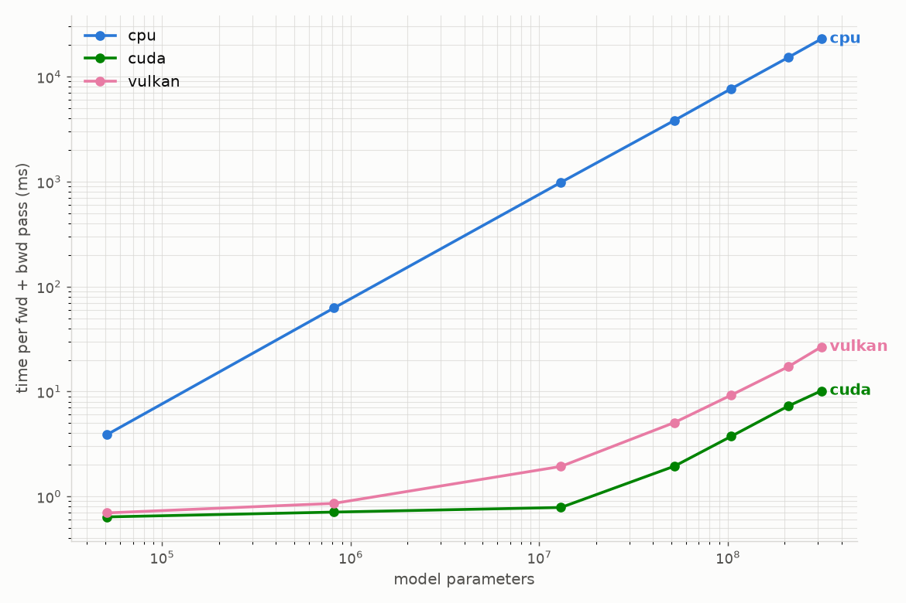
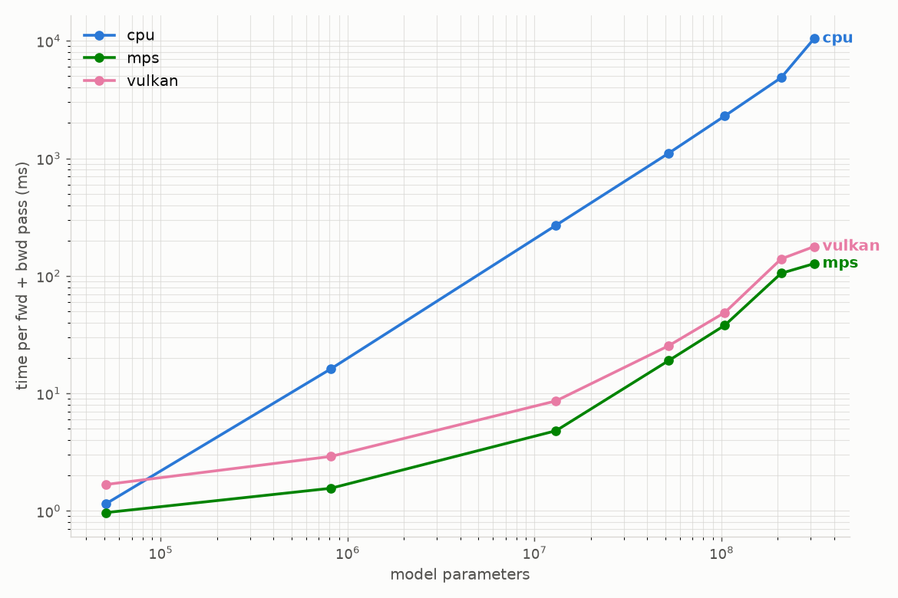

<h1 align="center">torchvulkan</h1>
<p align="center">
  <i>A Cross-Platform Vulkan Backend for PyTorch</i>
</p>

<p align="center">
  <a href="https://github.com/zainsharief/torchvulkan/actions/workflows/test_torchvulkan.yml"></a>
  <a href="LICENSE"></a>
  
  
</p>

`torchvulkan` registers a `vulkan` device with PyTorch and runs tensor operations as [Vulkan](https://www.vulkan.org/) compute shaders. Vulkan runs on GPUs from AMD, Intel, NVIDIA, and Apple (via MoltenVK), plus software rasterizers, so you get one vendor-neutral GPU backend across Linux, macOS, and Windows.

You use it like any other PyTorch device:

```python
import torch
import torchvulkan  # registers the 'vulkan' device on import

x = torch.randn(1024, 1024).to("vulkan")
y = torch.randn(1024, 1024).to("vulkan")

z = (x @ y).relu()      # runs on the GPU via Vulkan compute shaders
print(z.sum().item())   # move a scalar back to the CPU
```

> [!WARNING]
> **Experimental.** `torchvulkan` is an early-stage project. A small set of operators is implemented natively; everything else falls back to the CPU. Expect breaking changes before `1.0`.

## Table of contents

- [Installation](#installation)
- [Quickstart](#quickstart)
- [Example: training MNIST](#example-training-mnist)
- [Benchmarks](#benchmarks)
- [Python API](#python-api)
- [CPU fallback](#cpu-fallback)
- [Limitations](#limitations)
- [How it works](#how-it-works)

## Installation

```bash
pip install torchvulkan
```

At runtime you need a **Vulkan driver**: your GPU's driver on Linux and Windows (or a software rasterizer such as Mesa [lavapipe](https://docs.mesa3d.org/drivers/llvmpipe.html)), or [MoltenVK](https://github.com/KhronosGroup/MoltenVK) on macOS. Verify it worked:

```python
import torchvulkan
print(torchvulkan.is_available(), torchvulkan.device_count())
```

<details>
<summary><b>Building from source</b></summary>

Prebuilt wheels are published for Linux (x86_64), macOS (Apple Silicon), and Windows (x86_64) on Python 3.10 to 3.14. On other platforms `pip` builds from the source distribution, which needs the shader toolchain below. The same steps build a local checkout for development.

| Requirement | Notes |
| --- | --- |
| A Vulkan driver / loader | Your GPU's Vulkan driver, or a software rasterizer such as Mesa [lavapipe](https://docs.mesa3d.org/drivers/llvmpipe.html). On macOS this is [MoltenVK](https://github.com/KhronosGroup/MoltenVK). |
| [Vulkan SDK](https://vulkan.lunarg.com/) | Provides Vulkan headers and `spirv-cross`. |
| [`slangc`](https://github.com/shader-slang/slang/releases) | The Slang shader compiler, on your `PATH`. |
| `spirv-cross` | Ships with the Vulkan SDK (or your package manager). |
| CMake ≥ 3.18 + a C++20 compiler | Ninja is recommended (`SKBUILD_CMAKE_GENERATOR=Ninja`). |
| `torch==2.13.0` | Install before building; the extension is compiled against this exact version. |

> The exact per-OS commands CI uses to install this toolchain live in [`.github/actions/setup-toolchain`](.github/actions/setup-toolchain/action.yml).

```bash
pip install torch==2.13.0
pip install .            # editable install for development: pip install -e .
```

</details>

## Quickstart

```python
import torch
import torchvulkan

# Move tensors to the Vulkan device
a = torch.tensor([[1.0, 2.0], [3.0, 4.0]], device="vulkan")
b = torch.ones(2, 2, device="vulkan")

c = a @ b + 1.0          # matmul + broadcasted add
d = c.exp().sum(dim=0)   # elementwise + reduction

print(d.cpu())           # bring the result back to the CPU
```

`nn.Module`s move to the device the usual way:

```python
model = torch.nn.Linear(128, 10).to("vulkan")
out = model(torch.randn(32, 128).to("vulkan"))
```

## Example: training MNIST

[`examples/mnist.py`](examples/mnist.py) trains a small fully-connected network on the Vulkan device end to end. Forward, loss, backward, and an Adam step all run through the backend:

```bash
pip install torchvision
python examples/mnist.py
```

```python
device = torch.device("vulkan" if torchvulkan.is_available() else "cpu")
model = SimpleNN().to(device)
criterion = torch.nn.CrossEntropyLoss()
optimizer = torch.optim.Adam(model.parameters(), lr=1e-3)

for data, targets in train_loader:
    data, targets = data.to(device), targets.to(device)
    loss = criterion(model(data), targets)
    optimizer.zero_grad()
    loss.backward()
    optimizer.step()
```

## Benchmarks

[`benchmark/mnist_benchmark.py`](benchmark/mnist_benchmark.py) times a combined forward + backward pass of the MNIST network (in `float16`), sweeping the hidden width so the parameter count grows from ~50K up to ~312M.

Compared against the platform-native GPU backend, the `vulkan` device tracks closely and stays orders of magnitude ahead of the CPU as the model grows:

<p align="center">
  
  
</p>

<p align="center">
  <i>Left: NVIDIA GPU (vulkan vs. CUDA). Right: Apple Silicon (vulkan vs. MPS).</i>
</p>

```bash
pip install matplotlib
python benchmark/mnist_benchmark.py
```

## Python API

```python
import torchvulkan

torchvulkan.is_available()   # -> bool: a usable Vulkan device was found
torchvulkan.device_count()   # -> int: number of Vulkan devices
torchvulkan.synchronize()    # block until queued GPU work has finished
torchvulkan.empty_cache()    # release cached device memory back to the driver
torchvulkan.__version__      # package version
```

Importing `torchvulkan` registers the backend, after which the device is addressed as `"vulkan"` / `torch.device("vulkan")` throughout PyTorch.

## CPU fallback

By default, any operation, dtype, or tensor shape the backend doesn't implement natively runs on the **CPU** (with a one-time warning), so models keep working despite partial coverage.

Set `TORCHVULKAN_STRICT=1` to turn those silent fallbacks into errors. This is useful for finding which operators a workload actually needs:

```bash
TORCHVULKAN_STRICT=1 python your_script.py
```

## Limitations

- `bfloat16` and complex dtypes not natively supported; falls back to the CPU.
- Tensor rank ≤ 4. Tensors with more than 4 dimensions fall back to the CPU.
- `torch>=2.10.0` only. The extension is compiled against 2.13.0 but has testing support for >=2.10.0.
- APIs and coverage may change before `1.0.0`.

## How it works

1. Importing the package registers a PyTorch `PrivateUse1` backend and renames it to `vulkan`.
2. Operations dispatched to a `vulkan` tensor are routed to native implementations that record and submit **Vulkan compute shaders**. The shaders are written in [Slang](https://github.com/shader-slang/slang), compiled to SPIR-V at build time, and embedded into the extension.
3. Device memory is managed with [VMA](https://github.com/GPUOpen-LibrariesAndSDKs/VulkanMemoryAllocator); Vulkan entry points are loaded with [volk](https://github.com/zeux/volk).
4. Anything without a native implementation is handled by [CPU fallback](#cpu-fallback).


> [!NOTE]
> **Disclaimer:** `torchvulkan` is an independent open-source project and is not affiliated with or endorsed by PyTorch or the Linux Foundation.
